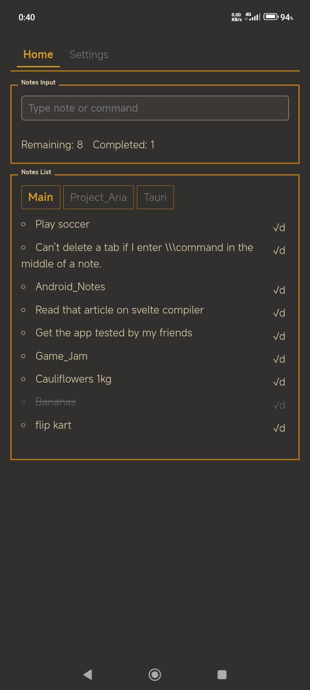
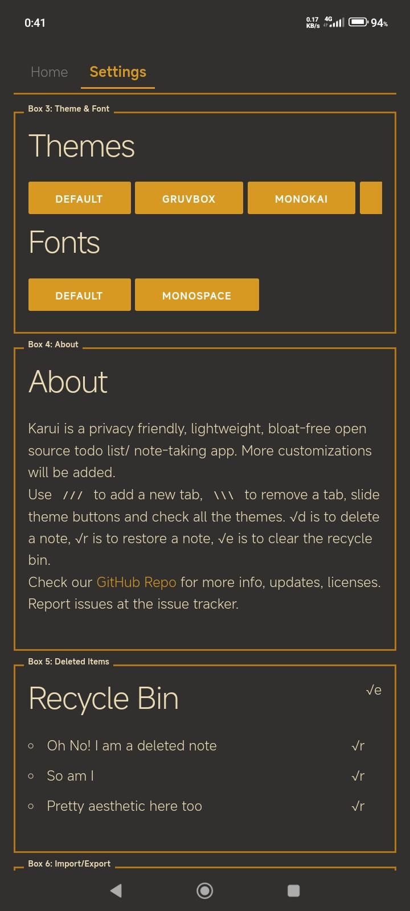

# Karui ToDo

  

## Overview

An open source Google Tasks alternative to quickly jot down things to do.  
Inspired by the system-24 theme and the Windows Mobile design system, this app's design is set to evolve into something even more eye-catching.

## Screenshots

  
  

## Features

- **Simple note taking and list making:** Includes an undo delete feature.
- **Retro terminalesque design:** Inspired by Unix customizations found online.
- Use unix like commands to set or remove notes tabs.
- **Lightweight:** Consumes only 0.05% CPU and 128KB of RAM. After all, simple apps shouldn't need more—remember, the Apollo mission operated on a computer with around 4KB of RAM!
- **Highly customizable:** Offers many themes with plans to add more customizations such as fonts, font sizes, and border colors.

## Features That Won't Be Added

- **Editing a note:** Experience shows that editing a todo list can lead to chaining multiple tasks. The purpose here is to quickly jot down ideas and tasks, not for deep thinking. For that, a dedicated text editor is more appropriate. (Open to discussion!)

## No Cloud Integration

This app is designed to operate entirely locally, with no cloud storage involved.

## Tab Management

- To add a new note tab, use the `///TabName` format.
- To remove any tab (except the Main tab), use the `\\\TabName` format.

## Releases

Stay updated via our [RSS feed for GitHub releases](https://github.com/ronynn/karui/releases.atom) which includes detailed release notes.

## Roadmap

- [ ] Get user feedback and suggestions to improve and expand the project scope.
- [x] Fix import `.json` bugs.
- [ ] Enhance accessibility with larger touch areas.
- [ ] Resolve dynamic color issues (😔 still figuring this one out—maybe a short break is needed).
- [ ] Add translations.
- [ ] Introduce more themes and font options.
- [ ] Implement design changes.
- [ ] Make the UI more responsive for tablets and larger screens.
- [ ] Develop widgets (e.g., Java fetching notes from localStorage, a static scrollable list of existing notes).
- [ ] Explore cloud saving options.
- [ ] Integrate app data piping to Obsidian or a new notes app.
- [ ] Add share intent functionality (to support QR apps that generate QR codes from text or `.json`).
- [ ] Incorporate a QR library to generate QR codes from notes and read them using the system camera, facilitating easy note sharing between devices.