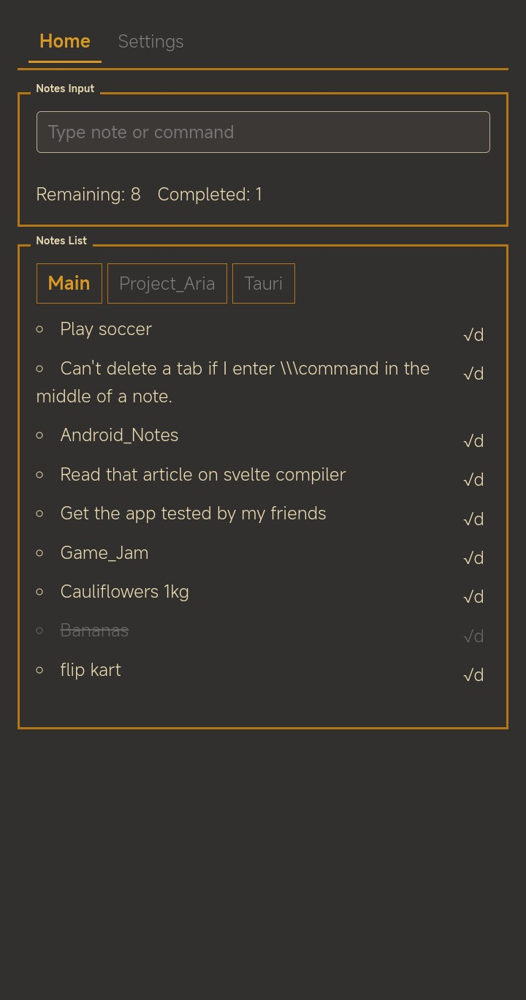
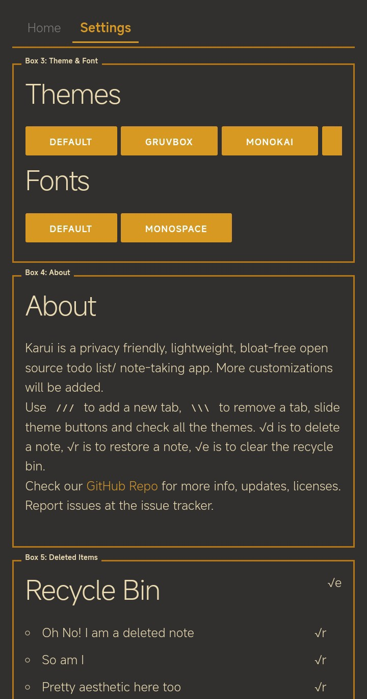

# Karui ToDo

  

## Overview

An open source Google Tasks alternative to quickly jot down things to do.  
Inspired by the system-24 theme and the Windows Mobile design system, this app's design is set to evolve into something even more eye-catching.

## Screenshots

  
  

## Features

- **Simple note taking and list making:** Includes an undo delete feature.
- **Retro terminalesque design:** Inspired by Unix customizations found online.
- Use unix like commands to set or remove notes tabs.
- **Lightweight:** Consumes only 0.05% CPU and 128KB of RAM. After all, simple apps shouldn't need more—remember, the Apollo mission operated on a computer with around 4KB of RAM!
- **Highly customizable:** Offers many themes with plans to add more customizations such as fonts, font sizes, and border colors.

## Features That Won't Be Added

- **Editing a note:** Experience shows that editing a todo list can lead to chaining multiple tasks. The purpose here is to quickly jot down ideas and tasks, not for deep thinking. For that, a dedicated text editor is more appropriate. (Open to discussion!)

## No Cloud Integration

This app is designed to operate entirely locally, with no cloud storage involved. The app doesn't asks for internet permissions and cannot connect to the internet. Further updates won't add internet permissions either, by design.

## Usage

- Use the input box to make new notes, touch a note to strikethough it, marking it done.
- Pressing √d deletes a note  it can be restored from recycle bin with √r, √e empties the recycle bin.
- To add a new note tab, use the `///TabName` format.
- To remove any tab (except the Main tab), use the `\\\TabName` format.

## Releases

- You can download the latest apk from github releases section here: [Releases](https://github.com/ronynn/karui/releases)

- Stay updated via our [RSS feed for GitHub releases](https://github.com/ronynn/karui/releases.atom) which includes detailed release notes.

- You can get it from the izzyondroid f-droid repo: 
 

## Contact
Github Issues are the fastest way to get in touch, for other means there's gitlab, bluesky, and my dev.to account, all linked in my account page on github and [homepage](https://ronynn.github.io).

## Licenses
Karui is being developed under the GPLv3 License.

## Contributions
Contributions are welcome, setting up takes nothing more than forking the project and utilising the github actions build setup. Currently I am porting the project from alpinejs to svelte, so I expect new contributions in svelte, but it's not a steadfast rule, I am still learning svelte and porting alpinejs based code so far hasn't feel like any hassle so far.

## Roadmap

- [ ] Get user feedback and suggestions to improve and expand the project scope.
- [x] Fix import `.json` bugs.
- [ ] Enhance accessibility with larger touch areas.
- [ ] Pivot control styled tab switcher
- [ ] Gesture flick to change tabs
- [ ] Resolve dynamic color issues (😔 still figuring this one out—maybe a short break is needed).
- [ ] Font size settings
- [ ] Pressing active tab tries to do some animation (#bug)
- [ ] Toggle option to use double tap √d to delete instead of a single tap.
- [ ] Add translations.
- [ ] Introduce more themes and font options.
- [ ] Make the UI more responsive for tablets and larger screens.
- [ ] Develop widgets (e.g., Java fetching notes from localStorage, a static scrollable list of existing notes).
- [ ] Explore cloud saving options without internet connection (piping to arcane chat? how would it sync?)
- [ ] Integrate app data piping to Obsidian or a new notes app.
- [ ] Add share intent functionality (to support QR apps that generate QR codes from text or `.json`).
- [ ] Karui opening theme should be gruvbox?
- [ ] Incorporate a QR library to generate QR codes from notes and read them using the system camera, facilitating easy note sharing between devices.

If you are using the app, don't forget to leave a star ⭐ here on github and let me know your suggestions!