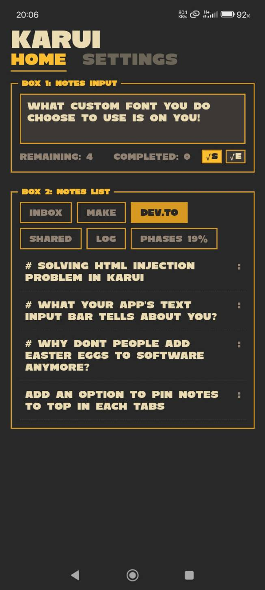
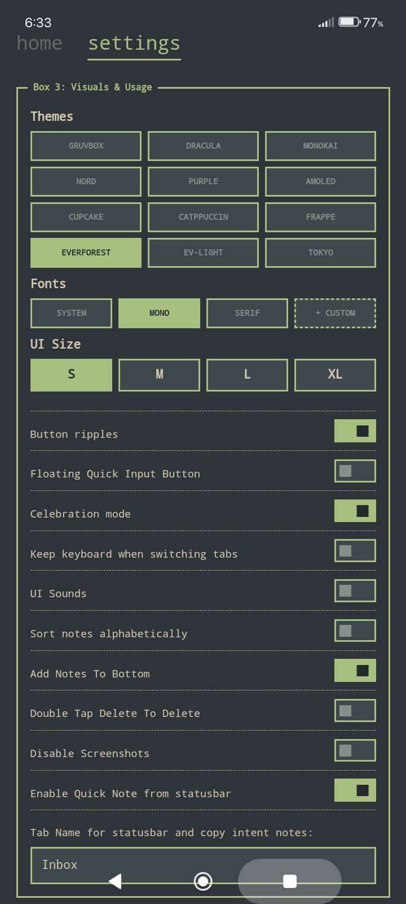
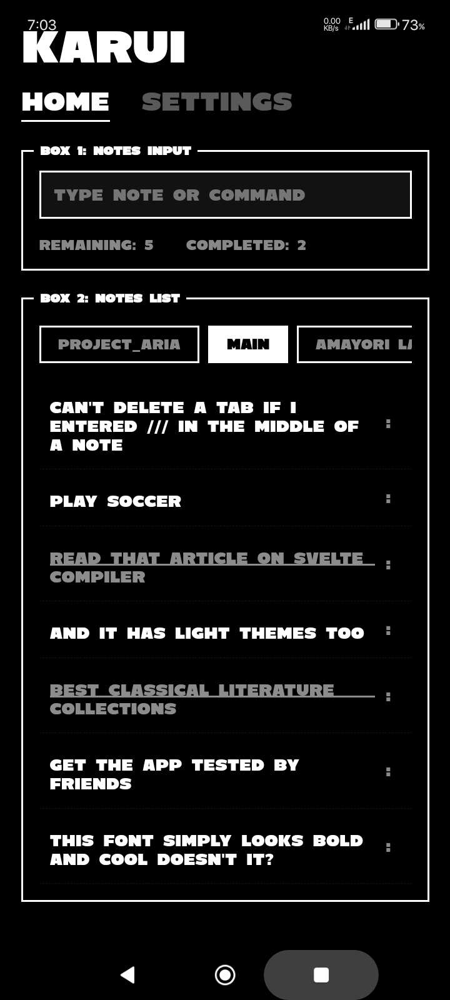
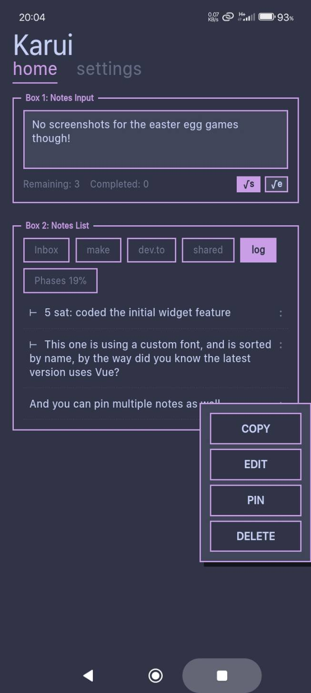
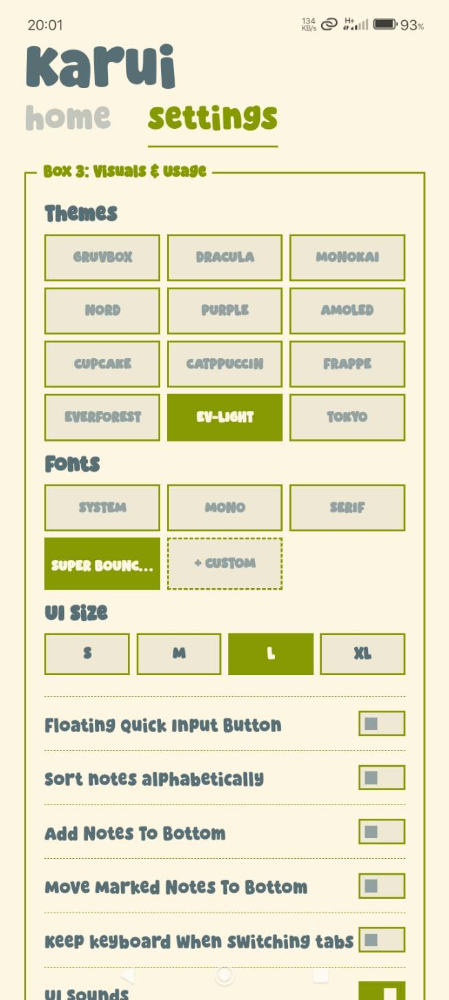
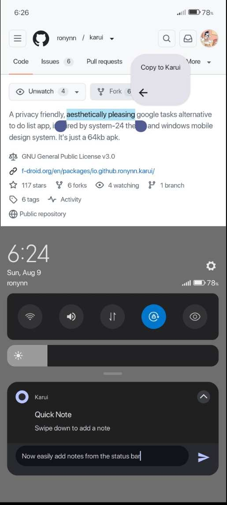
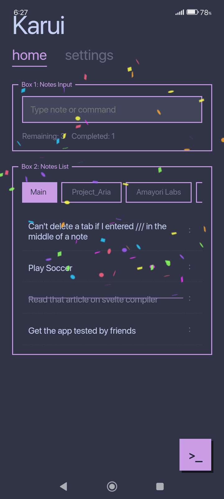
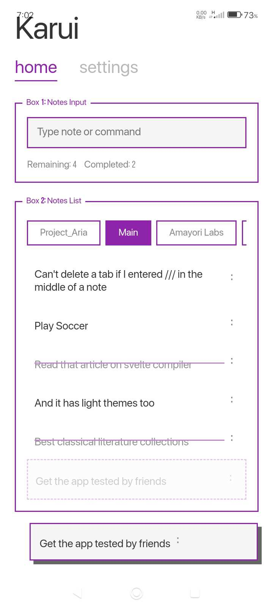
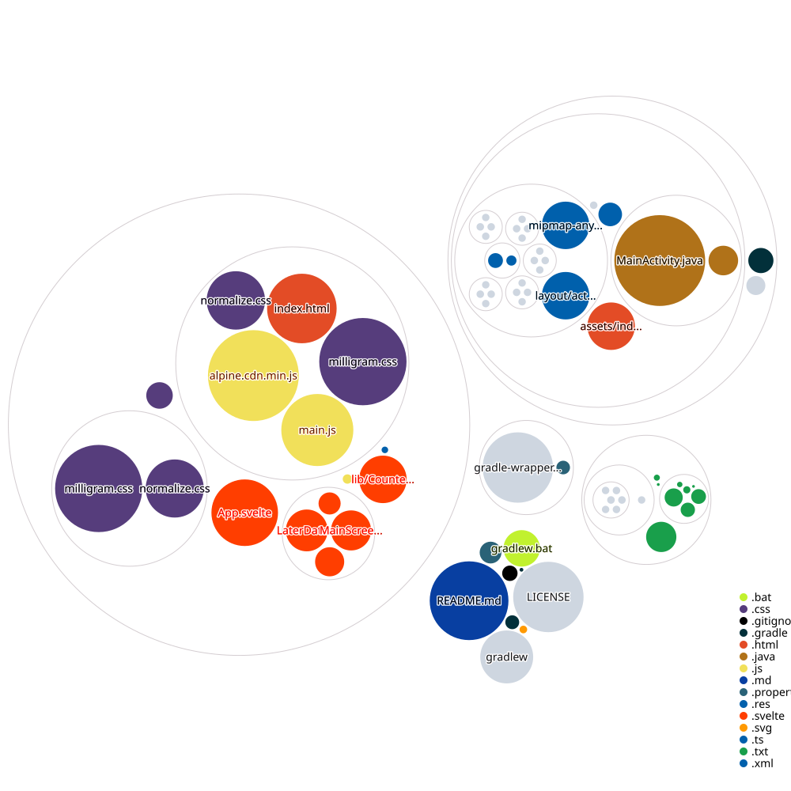

# Karui ToDo

  

An open source, privacy focussed, 90kB aesthetic todo list Google Tasks alternative to quickly jot down things to do. Inspired by the system-24 theme and the Windows Mobile design system, this app's design is evolving into being even more eye-catching.

This app never connects to the internet, you can setup sync to use Karui on other devices or alongside other markdown/text editors as the synced file is a markdown file. To use the widgets, first setup sync as the widget simply reads and writes to the markdown file, thus being energy efficient. 

All versions of the app are completely reproducible, just fork the source code from any older release tag. For just a quick read of the older versions and their source code see the archive folder. There you will find the previous Alpine.js, Svelte and Vanilla Javascript versions.

## Screenshots

  
  
  
  
  
  
  
  

## Use it for

- Daily quick notetaking, tracking habits
- Tasks list with percentage remaining metrics
- Taking notes from status bar or other app without switching to Karui or leaving opened app
- Taking design ideas when on youtube, instagram, snapchat, whatsapp, tiktok
- Capture passing thoughts when on a jog
- Journal events of your daily life on a separate tab, a daily log of activities
- Making bucket lists
- Playing quick mobile games (easter eggs)
- Use it like a password manager, save your passwords for quick access with copy paste at one place

## Features

- Simple note taking and list making with home screen widgets, status bar input, offline sync, recycle bin, drag-and-drop sorting.
- Bold New UI Design, leaning slightly more into windows-8 metro and windows mobile aesthetics with a mash up of retro terminalesque design inspired by Unix customizations found online.
- Lightweight: Consumes only 0.05% CPU and 128KB of RAM. After all, simple apps shouldn't need more—remember, the Apollo mission operated on a computer with around 4KB of RAM!
- Highly customizable: Offers many themes with option for custom fonts.
- To add a new note tab: use the `/TabName` format. Bringing some Linux Terminal vibes.
- To remove any tab (except the Main tab): use the `\TabName` format.
- Or just long-press any tab to rename, delete or add new tab (has a shadow that kinda brings back MS-DOS vibes)
- Support for custom fonts, so pick and select any .ttf files you like from your files system
- Add notes from status bar, or from other apps when selecting text (my mind races with ideas when watching youtube so I added this feature), helpful for saving trivial stuff you notice when reading some article or maybe for searching it later.
- Add a % symbol on any tabname and it automatically counts percentage of tasks completed
- Optionally disable screenshots for privacy when screensharing or in general
- Optional UI Sounds, celebration mode with confetti, button ripple effects
- Easter egg games (what? my todolist has games?), following the trend from retro software, games like Flappy Bird, Snake and Moon lander. Use the codes FLAPTHEBIRD, SLITHER, MOONMAN to test them out, share your highscores on our telegram and reddit.

## Technology/ Features that won't be added

- Internet connectivity: Notepad is a sacred space and shouldn't connect to the internet, for syncing notes between devices this app provides features to set up a markdown file you can sync between devices with syncthing, and even edit with other editors
- To avoid size bloat, android libraries like androidx that are typically used for statusbar remoteInput and dynamic themeing have been avoided, as a result:-
    - The statusbar input box is handwritten native code without library dependencies
    - While we are skipping dynamic themeing, if your color set is not present in the themes just let me know in the github issues or telegram group.

## Working Demos before downloading

-  : Click and Watch this short [Youtube Demo](https://www.youtube.com/shorts/QCDx0tuOL2g)
 on using karui and about it's development.

## No Cloud Integration

- This app is designed to operate entirely locally, with no cloud storage involved. The app doesn't asks for internet permissions and cannot connect to the internet. Further updates won't add internet permissions either, by design.

## Latest Releases for Download

|Github | 
 
|
|---|---|
|IzzyOnDroid | 

 |
|F-droid |   | 

- )

- 

 : Stay updated via our [RSS feed for GitHub releases](https://github.com/ronynn/karui/releases.atom) which includes detailed release notes.

## Licenses
Karui is being developed under the GPLv3 License.

## Roadmap /Beta Features

- [x] Letting user to select their own fonts from file picker
- [ ] Add translations (didn't face the need/demand)
- [x] Develop widgets (e.g., Java fetching notes from the .md file that gets synced)
- [ ] Explore cloud saving options without internet connection (piping to arcane chat? how would it sync?)
- [x] Integrate app data piping to Obsidian or a new notes app
- [ ] Incorporate a QR library to generate QR codes from notes and read them using the system camera, facilitating easy note sharing between devices. (qr too limited)

## Follow the Development

This app has been primarily made on my phone with Acode editor with alpine linux terminal (now on termux), while the dev environment doesn't matter, if you are building something with retro aesthetics or just with a minimalist design approach, show us your projects.

-  : Join us on telegram: <https://t.me/karuifoss>  Here you can find my thought process and approach with other's opinions.
-  : We now have recently created a discord server, here's the invite link:  <https://discord.gg/sYFsGN69rZ>, you can join and chat (on foss development)  
-  : And also a subreddit: <https://reddit.com/r/karuifoss>, would love it if you showcase your projects here and get cool discussions rolling

---
-  : ronynn's findings <https://m.youtube.com/@ronynn89> on all things tech, art, and filmmaking

- My blog <https://dev.to/ronynn> for tech opinions and findings
- Github Issues are still the fastest way to get in touch.

If you like the app, don't forget to leave a star ⭐ here on github and let me know your suggestions!

